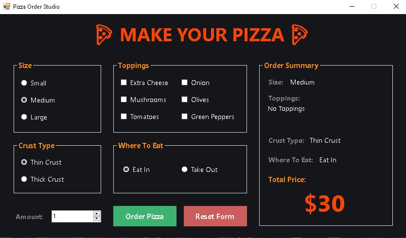
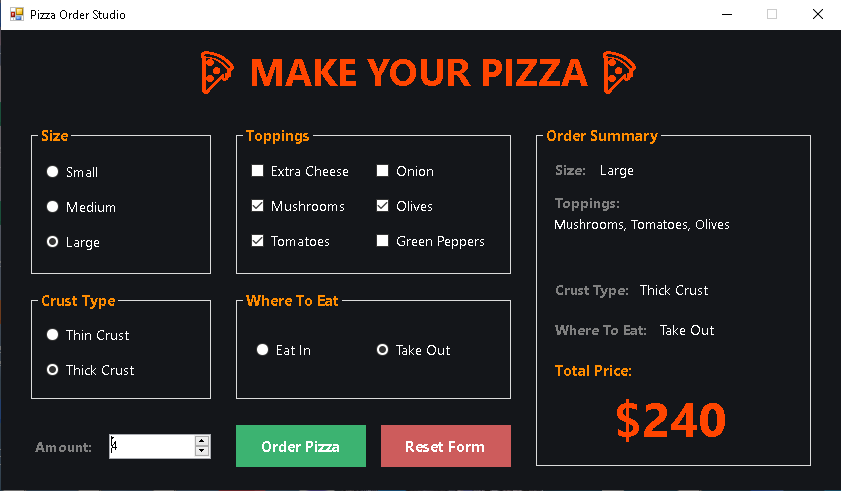
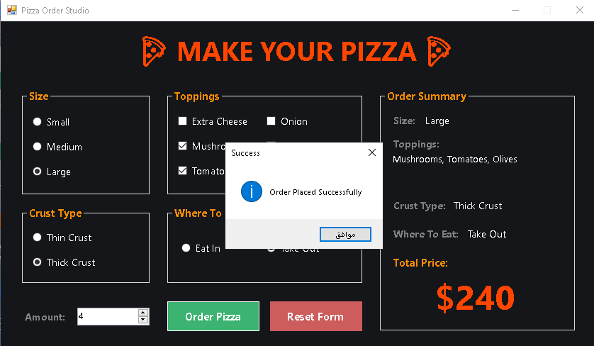

# 🍕 Pizza Order Studio

[](https://dotnet.microsoft.com/)
[](https://docs.microsoft.com/en-us/dotnet/csharp/)
[](https://docs.microsoft.com/en-us/dotnet/desktop/winforms/)
[](https://visualstudio.microsoft.com/)
[](LICENSE)

A clean, event-driven desktop application built with **C#** and **Windows Forms (.NET Framework 4.8)** using **Visual Studio Community Edition 2026** that allows users to customize pizza orders, calculate pricing dynamically in real time, and process orders through an intuitive dark-themed UI.

---

## 📸 Screenshots

| Main Interface | Order Customization | Order Confirmation |
| :---: | :---: | :---: |
|  |  |  |

---

## ✨ Features

- **Dynamic Real-Time Price Calculation:** Updates the total price instantly whenever size, toppings, crust type, or quantity changes.
- **Customization Options:**
  - **Pizza Sizes:** Small ($20), Medium ($30), Large ($40).
  - **Crust Types:** Thin Crust ($0), Thick Crust ($10).
  - **Toppings Selection:** Extra Cheese ($5), Mushrooms ($3), Tomatoes ($3), Olives ($4), Green Peppers ($6), Onion ($7).
  - **Order Quantity:** Adjustable numeric control for ordering multiple pizzas at once.
  - **Dining Choice:** Eat In or Take Out.
- **Order Summary Panel:** Live feedback display showing chosen configuration before confirmation.
- **Order Placement & Reset:** Lock interface controls upon order confirmation or clear all fields to start a new order.

---

## 💰 Pricing Structure

| Category | Option | Price |
| :--- | :--- | :--- |
| **Size** | Small | $20 |
| | Medium | $30 |
| | Large | $40 |
| **Crust** | Thin Crust | Free ($0) |
| | Thick Crust | +$10 |
| **Toppings** | Extra Cheese | +$5 |
| | Mushrooms | +$3 |
| | Tomatoes | +$3 |
| | Olives | +$4 |
| | Green Peppers | +$6 |
| | Onion | +$7 |

---

## 🛠️ Built With

- **Language:** C# 7.3
- **Framework:** .NET Framework 4.8
- **UI Framework:** Windows Forms (WinForms)
- **IDE:** Visual Studio Community Edition 2026

---

## 🚀 Getting Started

### 📦 Quick Download (Pre-built Executable)

If you want to test the application directly without installing Visual Studio or compiling source code:

1. Click the button above (or navigate to the **[Releases](../../releases)** page).
2. Download `Pizza-Order-Program-v1.0.0.zip`.
3. Extract the ZIP archive and run `Simple Pizza Project.exe`.

---

### 🛠️ Building From Source

#### Prerequisites

To build and run this application locally, ensure you have:

* [Visual Studio Community Edition 2026](https://visualstudio.microsoft.com/) (or Visual Studio 2019/2022 or higher)
* **.NET desktop development** workload installed.

#### Installation & Execution

1. **Clone the Repository**
```bash
git clone https://github.com/Abdullah-Shalgam/simple-pizza-project.git
cd simple-pizza-project

```


2. **Open the Project**
* Double-click `Simple Pizza Project.slnx` or open it via Visual Studio.


3. **Build & Run**
* Press `F5` or click **Start** in Visual Studio.

---

## 📬 Contact & Developer Info

[](https://github.com/Abdullah-Shalgam)
[](https://www.linkedin.com/in/%D8%B9%D8%A8%D8%AF%D8%A7%D9%84%D9%84%D9%87-%D8%B4%D9%84%D8%BA%D9%88%D9%85-289506438)
[](https://instagram.com/abdullah_shalgam)
[](https://wa.me/2180931364346)
[](mailto:bdallhshlghwm500@gmail.com)

---

## 📝 License

Distributed under the MIT License. See `LICENSE` for more information.